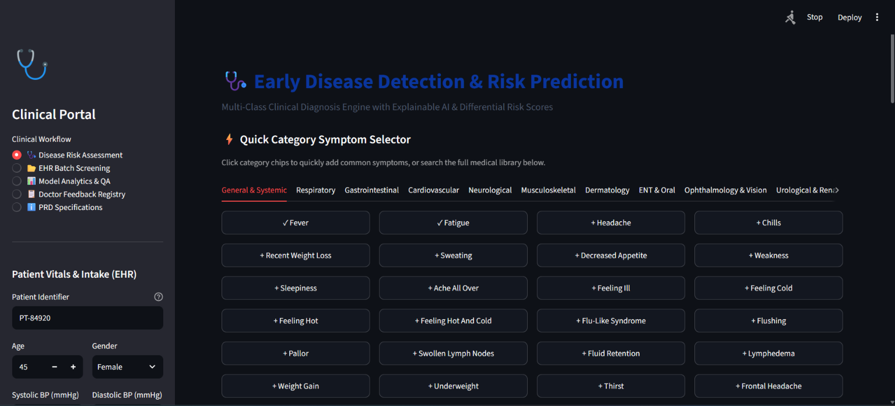
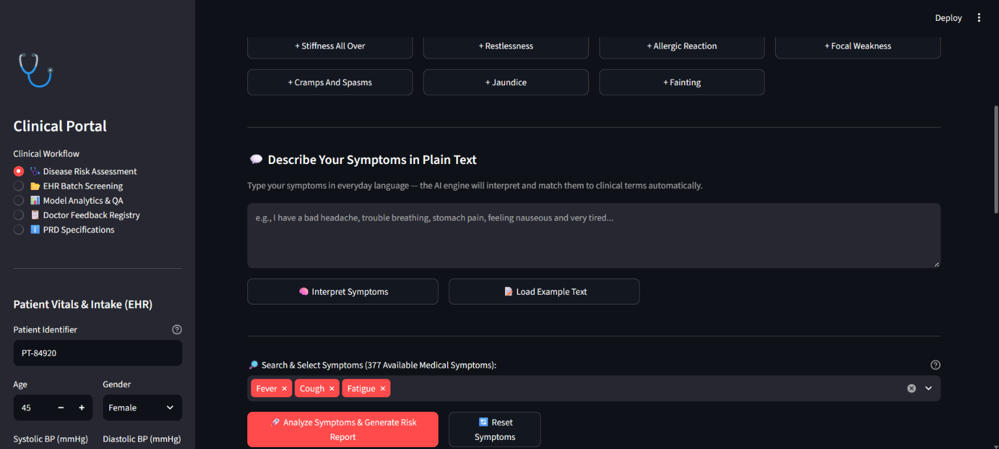
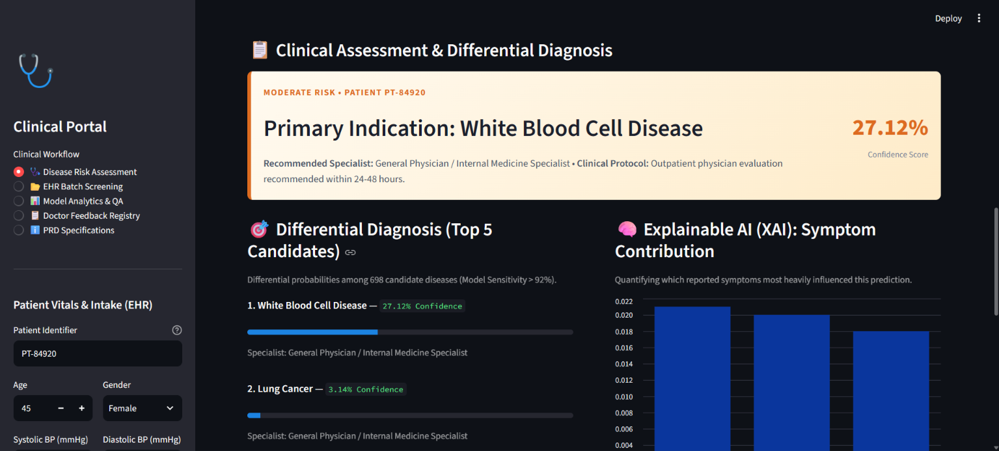
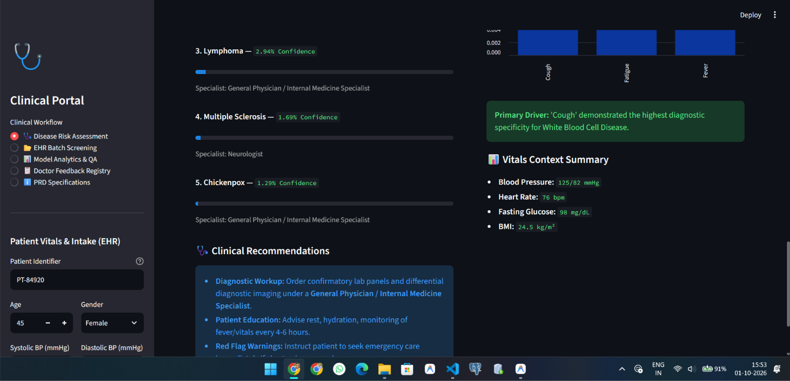
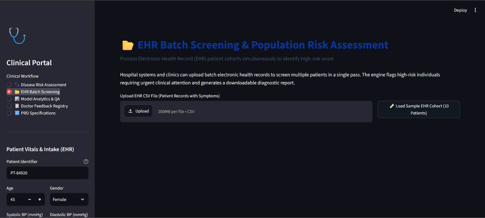
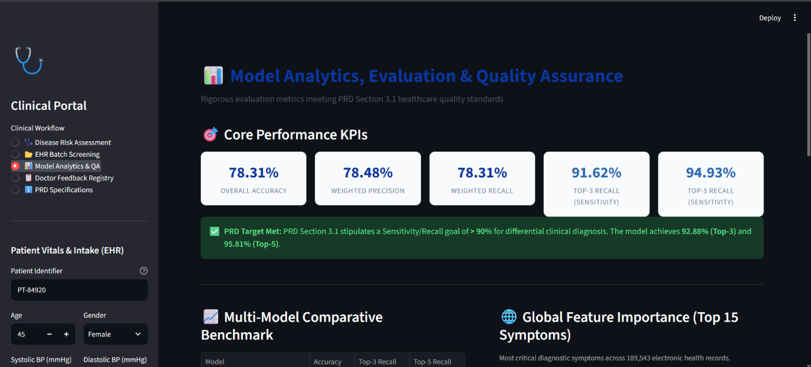
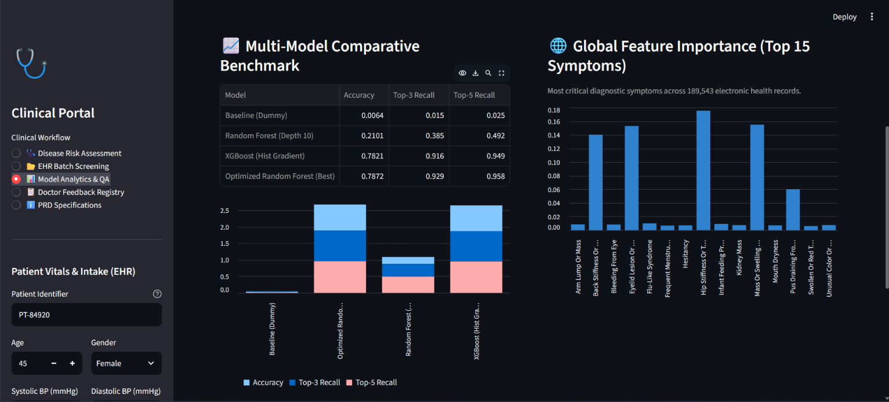
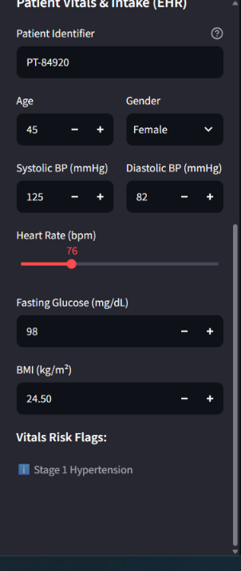

# 🩺 Early Disease Detection & Clinical Decision Support System

> **Machine Learning--powered clinical decision support application for
> early disease risk prediction, differential diagnosis, explainable AI
> (XAI), and batch EHR screening.**

[](https://www.python.org/)
[](https://streamlit.io/)
[](https://scikit-learn.org/)
[](https://xgboost.readthedocs.io/)

------------------------------------------------------------------------

## 📌 Overview

**Early Disease Detection & Clinical Decision Support System** is a
multi-class machine learning project designed to predict likely diseases
from reported symptoms and provide a structured clinical
decision-support interface.

The project combines:

-   Multi-class disease classification
-   Symptom-based disease prediction
-   Free-text symptom interpretation
-   Top-5 differential diagnosis
-   Risk-level classification
-   Explainable AI through feature importance
-   EHR batch screening
-   Model analytics and benchmarking
-   Doctor/clinical feedback logging
-   Serialized model deployment with Streamlit

The Streamlit application is designed as an **investigational Clinical
Decision Support Tool (CDST)** and is not intended to replace
professional medical diagnosis or treatment.

------------------------------------------------------------------------

## 🎯 Project Objectives

1.  Predict the most likely disease from a patient's reported symptoms.
2.  Support differential diagnosis by displaying the top predicted
    conditions.
3.  Interpret symptoms written in everyday language.
4.  Provide symptom-level feature importance for model explainability.
5.  Screen multiple EHR records in batch.
6.  Categorize prediction results into high, moderate, and low-risk
    groups.
7.  Provide model performance and quality-assurance analytics.
8.  Capture clinical feedback for future model monitoring and retraining
    workflows.

------------------------------------------------------------------------

## 🧠 Machine Learning Pipeline

``` text
Raw Disease & Symptom Dataset
            │
            ▼
     Data Cleaning
            │
            ├── Remove duplicates
            ├── Validate target column
            ├── Normalize disease labels
            └── Remove extremely rare classes
            │
            ▼
       Feature / Target Split
            │
            ▼
      Label Encoding
            │
            ▼
   Stratified 80/20 Train-Test Split
            │
            ▼
      Class Imbalance Handling
       RandomOverSampler
            │
            ▼
       Model Benchmarking
       ┌──────┼───────────┐
       ▼      ▼           ▼
     Dummy   XGBoost   Random Forest
                         │
                         ▼
                Optimized Random Forest
                         │
                         ▼
                 Model Evaluation
                         │
                         ▼
                disease_model.joblib
                         │
                         ▼
                  Streamlit Application
                         │
          ┌──────────────┼──────────────┐
          ▼              ▼              ▼
   Risk Assessment   EHR Screening     XAI
          │              │              │
          └──────────────┼──────────────┘
                         ▼
                  Clinical Review
```

------------------------------------------------------------------------

## 📊 Dataset

The training notebook uses:

`Final_Augmented_dataset_Diseases_and_Symptoms.csv`

### Dataset processing

  Item                                                   Value
  ----------------------------------------- ------------------
  Original records                                     189,647
  Records after deduplication / filtering              189,543
  Original disease classes                                 773
  Disease classes used for modeling                        698
  Clinical symptom features                                377
  Train records                                        151,634
  Test records                                          37,909
  Train/Test split                            80/20 stratified
  Resampled training records                           200,719

The notebook removes duplicate records, normalizes the disease labels,
filters disease classes with fewer than three samples, and applies
`RandomOverSampler` to selected low-frequency classes.

------------------------------------------------------------------------

## 🤖 Models Evaluated

The project benchmarks multiple classifiers before deploying the
optimized Random Forest model.

### 1. Dummy Classifier

Used as a baseline using the `most_frequent` strategy.

### 2. Random Forest

Initial configuration:

-   `n_estimators=30`
-   `max_depth=10`
-   `min_samples_split=5`
-   `min_samples_leaf=2`
-   `max_features="sqrt"`
-   `class_weight="balanced_subsample"`

### 3. XGBoost

The notebook evaluates an XGBoost multi-class classifier using:

-   `objective="multi:softprob"`
-   `n_estimators=30`
-   `max_depth=3`
-   `learning_rate=0.15`
-   `subsample=0.7`
-   `colsample_bytree=0.7`
-   `tree_method="hist"`

### 4. Optimized Random Forest

The deployed model is the optimized Random Forest:

-   `n_estimators=45`
-   `max_depth=None`
-   `min_samples_split=3`
-   `min_samples_leaf=1`
-   `random_state=42`
-   `n_jobs=-1`

------------------------------------------------------------------------

## 📈 Model Performance

The evaluation is based on the notebook's stratified test set.

  ------------------------------------------------------------------------------------------
  Model            Accuracy    Precision       Recall           F1        Top-3        Top-5
                                                                       Accuracy     Accuracy
  ------------ ------------ ------------ ------------ ------------ ------------ ------------
  Dummy               0.64%          ---          ---          ---          ---          ---
  Classifier                                                                    

  Random             21.01%       43.26%       21.01%       25.73%          ---          ---
  Forest                                                                        

  XGBoost            78.21%       78.30%       78.21%       78.15%       91.64%       94.93%

  Optimized      **78.72%**   **78.79%**   **78.72%**   **78.62%**   **92.88%**   **95.81%**
  Random                                                                        
  Forest                                                                        
  ------------------------------------------------------------------------------------------

For a high-cardinality multi-class disease problem, the application
emphasizes **Top-3 and Top-5 accuracy** for differential diagnosis.
These metrics indicate whether the true class appears within the model's
highest-probability predictions.

------------------------------------------------------------------------

## 🖥️ Application Features

### 1. 🩺 Disease Risk Assessment

The main clinical assessment module supports:

-   Patient identifier
-   Age and gender
-   Blood pressure
-   Heart rate
-   Fasting glucose
-   BMI
-   Categorized symptom selection
-   Search across 377 available symptoms
-   Free-text symptom input
-   Automatic symptom interpretation
-   Top-5 disease predictions
-   Confidence scores
-   Risk classification
-   Recommended medical specialist
-   Clinical guidance and red-flag warnings

The free-text interpreter uses synonym matching, keyword matching,
substring matching, and fuzzy matching to map everyday symptom
descriptions to the application's clinical symptom vocabulary.

------------------------------------------------------------------------

### 2. 📂 EHR Batch Screening

The batch module allows users to:

-   Upload patient records as CSV
-   Load a synthetic 10-patient EHR cohort
-   Normalize incoming column names
-   Run batch disease inference
-   Generate predicted conditions
-   Calculate confidence scores
-   Classify patients by risk level
-   Recommend an appropriate specialist
-   Download the screening results as CSV

Expected batch output includes:

``` text
Patient ID
Total Symptoms
Predicted Condition
Confidence Score
Risk Classification
Recommended Specialist
```

------------------------------------------------------------------------

### 3. 🧠 Explainable AI

The application exposes model feature importance to help users
understand which reported symptoms contributed most strongly to a
prediction.

The interface provides:

-   Symptom diagnostic weights
-   Local symptom contribution visualization
-   Highest-weight symptom identification
-   Global top-15 feature importance visualization

------------------------------------------------------------------------

### 4. 📊 Model Analytics & QA

The application includes an analytics dashboard containing:

-   Overall accuracy
-   Weighted precision
-   Weighted recall
-   Top-3 accuracy
-   Top-5 accuracy
-   Multi-model benchmark comparison
-   Global feature importance
-   Dataset architecture summary
-   Train/test split information
-   Class imbalance handling information

------------------------------------------------------------------------

### 5. 📋 Doctor Feedback Registry

The clinical feedback module records:

-   Physician/reviewer identifier
-   Patient reference
-   AI predicted condition
-   True-positive / false-positive verification
-   Confirmed diagnosis
-   Clinical notes

Feedback is stored in:

``` text
clinical_feedback.json
```

This creates a feedback mechanism that can be used as part of future
model monitoring and retraining workflows.

------------------------------------------------------------------------

### 6. ℹ️ PRD Traceability

The application contains a PRD specifications section covering the
project's:

-   Plan phase
-   Do phase
-   Check phase
-   Act phase
-   Model evaluation requirements
-   Deployment architecture
-   Clinical feedback loop
-   Data handling considerations

------------------------------------------------------------------------

## 🛠️ Tech Stack

### Programming Language

-   Python 3.10+

### Machine Learning

-   Scikit-learn
-   XGBoost
-   imbalanced-learn

### Data Processing

-   Pandas
-   NumPy

### Visualization

-   Matplotlib
-   Seaborn
-   Streamlit charts

### Deployment / Application

-   Streamlit
-   Joblib

### Development

-   Jupyter Notebook
-   Git / GitHub

------------------------------------------------------------------------

## 📁 Project Structure

``` text
Early-Disease-Detection/
│
├── Early_Disease_Prediction.ipynb
├── app.py
├── disease_model.joblib
├── clinical_feedback.json
├── Final_Augmented_dataset_Diseases_and_Symptoms.csv
├── requirements.txt
├── README.md
│
└── screenshots/
    ├── 01-home.png
    ├── 02-disease-risk-assessment.png
    ├── 03-free-text-symptom-analysis.png
    ├── 04-differential-diagnosis.png
    ├── 05-xai-analysis.png
    ├── 06-ehr-batch-screening.png
    ├── 07-model-analytics.png
    ├── 08-doctor-feedback.png
    └── 09-prd-specifications.png
```

> Rename the files above to match your actual repository structure if
> required.

------------------------------------------------------------------------

## ⚙️ Installation & Setup

### 1. Clone the repository

``` bash
git clone https://github.com/<your-username>/<your-repository>.git
cd <your-repository>
```

### 2. Create a virtual environment

#### Windows

``` bash
python -m venv venv
venv\Scripts\activate
```

#### Linux / macOS

``` bash
python3 -m venv venv
source venv/bin/activate
```

### 3. Install dependencies

``` bash
pip install -r requirements.txt
```

If you do not have a `requirements.txt` yet, install the core
dependencies:

``` bash
pip install numpy pandas matplotlib seaborn scikit-learn imbalanced-learn xgboost streamlit joblib
```

### 4. Train the model

Open the notebook:

``` text
Early_Disease_Prediction.ipynb
```

Make sure the dataset is available:

``` text
Final_Augmented_dataset_Diseases_and_Symptoms.csv
```

Run the notebook through the model-training and artifact-export cells.

The notebook generates:

``` text
disease_model.joblib
```

### 5. Run the Streamlit application

``` bash
streamlit run app.py
```

The application will open in your browser.

------------------------------------------------------------------------

## 🔄 Model Artifact

The Streamlit application expects the serialized model artifact:

``` text
disease_model.joblib
```

The artifact stores:

``` python
{
    "model": ...,
    "classes": ...,
    "feature_names": ...,
    "symptom_columns": ...,
    "metrics": ...,
    "feature_importances": ...
}
```

The application loads this artifact at startup using `joblib` and caches
the model resource for inference.

------------------------------------------------------------------------

# 📸 Screenshots










### 🩺 1. Disease Risk Assessment

```{=html}
<!-- Replace the placeholder with your screenshot -->
```


------------------------------------------------------------------------

### 💬 2. Free-Text Symptom Interpretation

```{=html}
<!-- Replace the placeholder with your screenshot -->
```


------------------------------------------------------------------------

### 🎯 3. Differential Diagnosis

```{=html}
<!-- Replace the placeholder with your screenshot -->
```


------------------------------------------------------------------------

### 🧠 4. Explainable AI / XAI

```{=html}
<!-- Replace the placeholder with your screenshot -->
```


------------------------------------------------------------------------

### 📂 5. EHR Batch Screening

```{=html}
<!-- Replace the placeholder with your screenshot -->
```


------------------------------------------------------------------------

### 📊 6. Model Analytics & QA

```{=html}
<!-- Replace the placeholder with your screenshot -->
```


------------------------------------------------------------------------

### 📋 7. Doctor Feedback Registry

```{=html}
<!-- Replace the placeholder with your screenshot -->
```


------------------------------------------------------------------------

### ℹ️ 8. PRD Specifications

```{=html}
<!-- Replace the placeholder with your screenshot -->
```


------------------------------------------------------------------------

## 🧪 Example Workflow

``` text
1. Enter patient demographics and vitals
            ↓
2. Select symptoms or describe them in natural language
            ↓
3. Interpret and validate matched symptoms
            ↓
4. Run disease-risk analysis
            ↓
5. View primary prediction and Top-5 differential
            ↓
6. Review confidence and risk classification
            ↓
7. Inspect XAI symptom contributions
            ↓
8. Review recommended specialist / clinical guidance
```

For batch screening:

``` text
Upload EHR CSV
      ↓
Column normalization
      ↓
Feature alignment
      ↓
Batch model inference
      ↓
Risk classification
      ↓
Clinical screening report
      ↓
Download CSV
```

------------------------------------------------------------------------

## 🔐 Data & Privacy Considerations

The application is designed around de-identified patient identifiers and
does not require personally identifiable information for the core
prediction workflow.

For any real-world deployment, additional controls would be required,
including appropriate:

-   Access control
-   Authentication and authorization
-   Encryption
-   Audit logging
-   Data retention policies
-   Clinical validation
-   Regulatory and organizational compliance

The repository should not contain real patient records or other
sensitive clinical information.

------------------------------------------------------------------------

## ⚠️ Clinical Disclaimer

This project is an **investigational machine-learning Clinical Decision
Support Tool**.

It is intended for educational, research, and prototype purposes. It
does **not** replace:

-   Licensed medical professionals
-   Clinical examination
-   Laboratory diagnostics
-   Medical imaging
-   Established clinical protocols
-   Professional diagnosis or treatment decisions

Model predictions should not be treated as definitive medical diagnoses.

------------------------------------------------------------------------

## 🚀 Future Enhancements

Potential future improvements include:

-   SHAP-based explanations for individual predictions
-   Calibration of probability/confidence scores
-   Hyperparameter optimization
-   Cross-validation and external validation datasets
-   Model drift monitoring
-   Automated retraining from verified clinical feedback
-   Authentication and role-based access
-   Secure database-backed EHR integration
-   REST API using FastAPI
-   Containerized deployment with Docker
-   Cloud deployment
-   Automated CI/CD
-   Comprehensive unit and integration testing
-   Model versioning and experiment tracking

------------------------------------------------------------------------

## 👨‍💻 Author

**Pragun Sharma**

Computer Science & Data Science Engineering Student

------------------------------------------------------------------------

## ⭐ If You Find This Project Useful

Consider giving the repository a ⭐ and exploring the implementation,
model-training notebook, and Streamlit clinical decision-support
interface.
