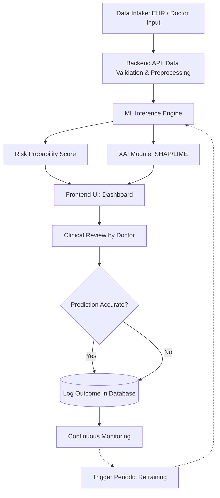

# Product Requirements Document (PRD)

**Project Name:** Early Disease Detection using Machine Learning
**Document Version:** 1.0
**Date:** September 30, 2026

## 1. PLAN (Planning, Strategy, and Requirements)

### 1.1 Project Overview

**Problem Statement:** Late diagnosis of chronic and critical diseases (e.g., cardiovascular diseases, diabetes, early-stage cancers) significantly reduces survival rates and increases treatment costs.
**Solution:** An Early Disease Detection system that leverages Machine Learning (ML) to analyze electronic health records (EHR), patient vitals, and historical health data to predict the probability of disease onset before severe symptoms appear.
**Target Audience:** Medical practitioners (doctors, nurses), hospital administrators, and potentially end-users (patients) via a consumer-facing wellness app.
**Goals:**

* Achieve high recall/sensitivity in predicting target diseases.
* Provide explainable AI (XAI) outputs so doctors understand *why* a prediction was made.
* Ensure 100% compliance with healthcare data regulations (e.g., HIPAA, GDPR).

### 1.2 Dataset

**Data Sources:**

* Anonymized Electronic Health Records (EHR).
* Public healthcare datasets (e.g., MIMIC-IV, Kaggle disease datasets, UCI Machine Learning Repository).
* Dataset used : Disease-Symptom Dataset 

**Data Features (Schema Preview):**

* **Demographics:** Age, Gender, BMI, Ethnicity.
* **Vitals:** Blood Pressure, Heart Rate, Fasting Blood Sugar, Cholesterol levels.
* **Medical History:** Family history of diseases, smoking/alcohol consumption status, previous diagnoses.

**Data Privacy & Compliance:**

* All datasets must undergo strict de-identification processes (removing PII/PHI).
* Data encrypted at rest and in transit.

## 2. DO (Execution, Architecture, and Development)

### 2.1 Tech Stack

* **Programming Language:** Python 3.10+
* **Machine Learning & Data Science:**
  * Pandas, NumPy (Data manipulation)
  * Scikit-Learn (Traditional ML models like Random Forest, SVM)
  * XGBoost / LightGBM (Gradient boosting for tabular data)
  * PyTorch or TensorFlow (Deep Learning for complex patterns, if applicable)
  * SHAP / LIME (Explainable AI for feature importance)
* **Frontend (Dashboard):** Streamlit (for rapid prototyping)

### 2.2 Execution Steps

1. **Data Preprocessing:** Handle missing values, normalize continuous variables, encode categorical variables, and apply SMOTE for handling imbalanced datasets (common in disease data).
2. **Model Training:** Train baseline models (Logistic Regression) and advanced ensembles (XGBoost).
3. **API Integration:** Expose the trained model via RESTful APIs so front-end applications can send patient data payloads and receive risk scores.

### 2.3 Project & System Flow

The system operates in a continuous cycle, seamlessly moving from data intake to actionable medical insights.

#### Visual Project Flow

```text
                         PROJECT START
                              |
                              v
                    ┌─────────────────────┐
                    │ Problem Definition │
                    └──────────┬──────────┘
                               |
                               v
                    ┌─────────────────────┐
                    │ Dataset Selection  │
                    └──────────┬──────────┘
                               |
                               v
                    ┌─────────────────────┐
                    │  Data Understanding │
                    └──────────┬──────────┘
                               |
                               v
                    ┌─────────────────────┐
                    │   Data Cleaning    │
                    └──────────┬──────────┘
                               |
                               v
                    ┌─────────────────────┐
                    │     Resampling     │
                    └──────────┬──────────┘
                               |
                               v
                    ┌─────────────────────┐
                    │        EDA          │
                    │  Trend / Analysis   │
                    └──────────┬──────────┘
                               |
                               v
                    ┌─────────────────────┐
                    │ Feature Engineering │
                    └──────────┬──────────┘
                               |
                               v
                    ┌─────────────────────┐
                    │   Baseline Models  │
                    └──────────┬──────────┘
                               |
                               v
                    ┌─────────────────────┐
                    │   Candidate Models │
                    └──────────┬──────────┘
                               |
                               v
                    ┌─────────────────────┐
                    │    Backtesting     │
                    └──────────┬──────────┘
                               |
                               v
                    ┌─────────────────────┐
                    │   Model Selection  │
                    └──────────┬──────────┘
                               |
                               v
                    ┌─────────────────────┐
                    │  Prediction / Risk │
                    │      Generation    │
                    └─────────────────────┘
```

#### System Flow Architecture Diagram (Mermaid)


#### Step-by-Step Breakdown

1. **Data Intake:** A healthcare professional enters new patient data (vitals, lab results) into the frontend dashboard, OR data is automatically pulled via an EHR API integration.
2. **Data Pipeline (Backend):** The incoming payload is sanitized, validated, and formatted to match the exact feature set the ML model was trained on (handling any missing live data).
3. **Model Inference:** The FastAPI backend passes the processed data to the trained ML model (e.g., XGBoost) to generate a "Disease Risk Probability Score" (0-100%).
4. **Explainability Generation:** The SHAP/LIME module analyzes the prediction and generates feature importance values (e.g., "High Fasting Blood Sugar contributed 45% to this risk score").
5. **Dashboard Rendering:** The UI displays the Risk Score (Green/Yellow/Red indicators), the Explainability Report, and historical patient trends.
6. **Clinical Review & Action:** The doctor reviews the AI suggestion, makes a clinical decision, and prescribes early intervention or further testing.
7. **Feedback Loop (To "Act" Phase):** The doctor verifies if the prediction was accurate (True Positive) or a False Alarm (False Positive). This outcome is logged into the database for future model retraining.

## 3. CHECK (Testing, Evaluation, and Quality Assurance)

### 3.1 Model Evaluation Metrics

In healthcare, missing a positive case (False Negative) is highly dangerous. Therefore, the evaluation will prioritize:

* **Recall (Sensitivity):** Must be > 90% to minimize false negatives.
* **F1-Score:** To balance precision and recall.
* **ROC-AUC:** To measure the model's ability to distinguish between healthy and high-risk patients.

### 3.2 System & Security Testing

* **Unit Testing:** PyTest for backend logic and data pipeline validation.
* **Load Testing:** Ensure the API can handle multiple concurrent prediction requests from hospital networks.
* **Compliance Audit:** Verify that no Patient Identifiable Information (PII) is logged or exposed during API responses.

## 4. ACT (Deployment, Maintenance, and Iteration)

### 4.1 Deployment

* **Containerization:** Dockerize the ML API and frontend application.
* **Orchestration:** Kubernetes (K8s) for scaling pods based on API traffic.
* **Cloud Infrastructure:** AWS (Amazon Web Services) or Google Cloud Platform (GCP).
  * *Compute:* AWS EC2 or Google Kubernetes Engine (GKE) for hosting the API.
  * *Storage:* AWS S3 for storing model artifacts (`.pkl` or `.pt` files) and raw data.
* **CI/CD Pipeline:** GitHub Actions or Jenkins to automate testing and deployment whenever a new model version is committed.

### 4.2 Continuous Improvement & Monitoring

* **Model Drift Monitoring:** Implement Evidently AI or a custom script to track if incoming real-world patient data deviates from the training dataset.
* **Feedback Loop:** Provide a mechanism for doctors to flag "False Positives" or "False Negatives" in the dashboard. This feedback will be stored in a retraining database.
* **Retraining Strategy:** Trigger model retraining quarterly or when data drift exceeds a predefined threshold (e.g., 5%).